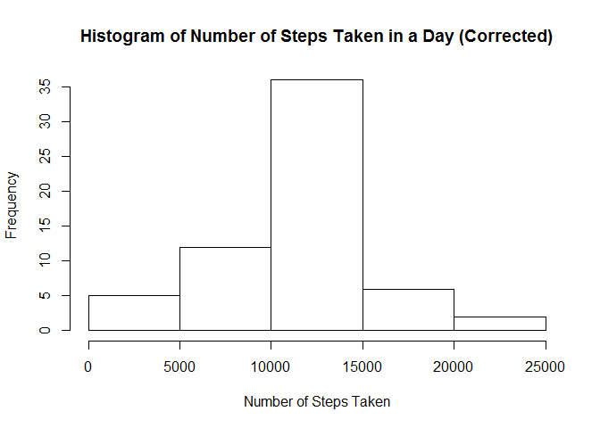

# Reproducible Research: Peer Assessment 1

```r
knitr::opts_chunk$set(fig.path='figure/')
```

## Loading and preprocessing the data

We're going to load the data from the local filesystem making sure to change the date datatype to Date.  We also create a data set that has removed the records with NA for steps.


```r
stepsData <- read.csv("activity.csv" , colClasses=c("numeric", "Date", "numeric"))
stepsDataWithoutNA <- subset(stepsData, !is.na(steps))
stepsPerDayWithoutNA <- aggregate(stepsDataWithoutNA$steps, FUN=sum, by=list(stepsDataWithoutNA$date))
```


## What is mean total number of steps taken per day?
Here's the histogram of the number of steps taken per day.


```r
hist(stepsPerDayWithoutNA$x, xlab="Number of Steps Taken", main="Histogram of Number of Steps Taken in a Day")
```

\

The mean number of steps per day is 10766.19 and the median is 10765.00.

## What is the average daily activity pattern?
This shows us the average steps taken by interval.


```r
averageStepsPerIntervalWithoutNA <- aggregate(stepsDataWithoutNA$steps, FUN=mean, by=list(stepsDataWithoutNA$interval))

plot(averageStepsPerIntervalWithoutNA$Group.1, averageStepsPerIntervalWithoutNA$x, type="l", xlab="Interval (across all days)", ylab="Average Steps Taken", main="Average Steps Taken by Interval")
```

\

The interval with the maximum average number of steps is 835.

## Imputing missing values

The total number of rows that have missing values is 2304.

To replace the NA values, we're going to use the average steps by interval.  We're doing this because there's no data for 10/1/2012.

Let's see what the histogram looks like as well.


```r
stepsDataCorrected <- merge(stepsData, averageStepsPerIntervalWithoutNA, by.x="interval", by.y="Group.1")
stepsDataCorrected[is.na(stepsDataCorrected$steps),]$steps=stepsDataCorrected[is.na(stepsDataCorrected$steps),]$x
stepsPerDayWithNA <- aggregate(stepsDataCorrected$steps, FUN=sum, by=list(stepsDataCorrected$date))

hist(stepsPerDayWithNA$x, xlab="Number of Steps Taken", main="Histogram of Number of Steps Taken in a Day (Corrected)")
```

\
The mean number of steps per day is 10766.19 and the median is 10766.19.

The mean and median are not appreciably different with the corrected data.

## Are there differences in activity patterns between weekdays and weekends?

Let's break the data out by weekend versus weekday.


```r
stepsDataCorrected$WeekDay = weekdays(stepsDataCorrected$date)
stepsDataCorrected[stepsDataCorrected$WeekDay == "Saturday",]$WeekDay= "weekend"
stepsDataCorrected[stepsDataCorrected$WeekDay == "Sunday",]$WeekDay= "weekend"
stepsDataCorrected[stepsDataCorrected$WeekDay != "weekend",]$WeekDay= "weekday"

averageAcrossIntervalAndWeekDay <- aggregate(stepsDataCorrected$steps, FUN=mean, by=list(stepsDataCorrected$interval, stepsDataCorrected$WeekDay))

library(lattice)
with(averageAcrossIntervalAndWeekDay, xyplot(x~Group.1|Group.2,group= Group.2, type="l", layout=c(1,2), xlab="Interval", ylab="Number of Steps"))
```

\
